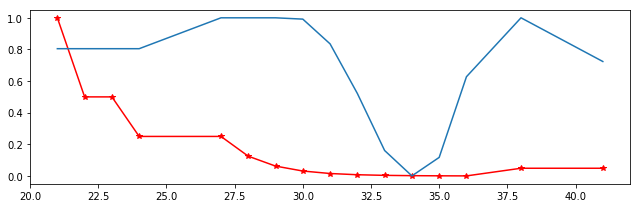
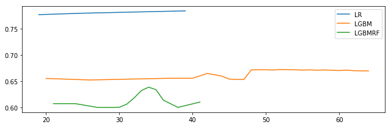
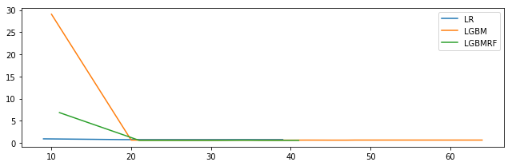
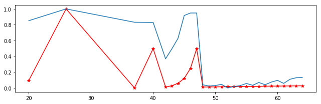
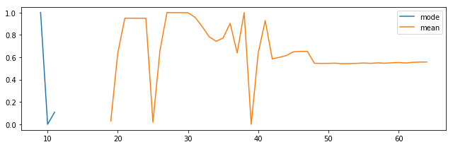
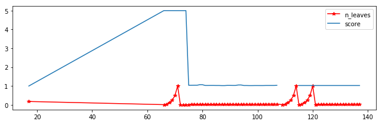

<h1>Table of Contents<span class="tocSkip"></span></h1>
<div class="toc"><ul class="toc-item"><li><span><a href="#Progetto-Google-Revenue-Kaggle" data-toc-modified-id="Progetto-Google-Revenue-Kaggle-1"><span class="toc-item-num">1&nbsp;&nbsp;</span>Progetto Google-Revenue Kaggle</a></span></li><li><span><a href="#Glossario" data-toc-modified-id="Glossario-2"><span class="toc-item-num">2&nbsp;&nbsp;</span>Glossario</a></span></li><li><span><a href="#Asserzioni-sui-dati" data-toc-modified-id="Asserzioni-sui-dati-3"><span class="toc-item-num">3&nbsp;&nbsp;</span>Asserzioni sui dati</a></span></li><li><span><a href="#Data-Load-and-Parsing" data-toc-modified-id="Data-Load-and-Parsing-4"><span class="toc-item-num">4&nbsp;&nbsp;</span>Data Load and Parsing</a></span><ul class="toc-item"><li><span><a href="#Introduzione" data-toc-modified-id="Introduzione-4.1"><span class="toc-item-num">4.1&nbsp;&nbsp;</span>Introduzione</a></span></li><li><span><a href="#Unpacking-e-Unfolding" data-toc-modified-id="Unpacking-e-Unfolding-4.2"><span class="toc-item-num">4.2&nbsp;&nbsp;</span>Unpacking e Unfolding</a></span></li><li><span><a href="#Conclusioni" data-toc-modified-id="Conclusioni-4.3"><span class="toc-item-num">4.3&nbsp;&nbsp;</span>Conclusioni</a></span></li></ul></li><li><span><a href="#Preprocessing" data-toc-modified-id="Preprocessing-5"><span class="toc-item-num">5&nbsp;&nbsp;</span>Preprocessing</a></span><ul class="toc-item"><li><span><a href="#Introduzione" data-toc-modified-id="Introduzione-5.1"><span class="toc-item-num">5.1&nbsp;&nbsp;</span>Introduzione</a></span></li><li><span><a href="#Funzione-encode_cats" data-toc-modified-id="Funzione-encode_cats-5.2"><span class="toc-item-num">5.2&nbsp;&nbsp;</span>Funzione encode_cats</a></span></li><li><span><a href="#Funzione-group_me" data-toc-modified-id="Funzione-group_me-5.3"><span class="toc-item-num">5.3&nbsp;&nbsp;</span>Funzione group_me</a></span></li><li><span><a href="#Conclusioni" data-toc-modified-id="Conclusioni-5.4"><span class="toc-item-num">5.4&nbsp;&nbsp;</span>Conclusioni</a></span></li></ul></li><li><span><a href="#Training-e-Scoring" data-toc-modified-id="Training-e-Scoring-6"><span class="toc-item-num">6&nbsp;&nbsp;</span>Training e Scoring</a></span><ul class="toc-item"><li><span><a href="#Introduzione" data-toc-modified-id="Introduzione-6.1"><span class="toc-item-num">6.1&nbsp;&nbsp;</span>Introduzione</a></span></li><li><span><a href="#Lin-reg" data-toc-modified-id="Lin-reg-6.2"><span class="toc-item-num">6.2&nbsp;&nbsp;</span>Lin-reg</a></span></li><li><span><a href="#LightGBM" data-toc-modified-id="LightGBM-6.3"><span class="toc-item-num">6.3&nbsp;&nbsp;</span>LightGBM</a></span></li><li><span><a href="#Conclusioni" data-toc-modified-id="Conclusioni-6.4"><span class="toc-item-num">6.4&nbsp;&nbsp;</span>Conclusioni</a></span></li></ul></li><li><span><a href="#Scelte" data-toc-modified-id="Scelte-7"><span class="toc-item-num">7&nbsp;&nbsp;</span>Scelte</a></span><ul class="toc-item"><li><span><a href="#(No)-EDA" data-toc-modified-id="(No)-EDA-7.1"><span class="toc-item-num">7.1&nbsp;&nbsp;</span>(No) EDA</a></span></li><li><span><a href="#transactionRevenue-e-totalTransactionRevenue" data-toc-modified-id="transactionRevenue-e-totalTransactionRevenue-7.2"><span class="toc-item-num">7.2&nbsp;&nbsp;</span>transactionRevenue e totalTransactionRevenue</a></span></li><li><span><a href="#Inefficienza-della-moda" data-toc-modified-id="Inefficienza-della-moda-7.3"><span class="toc-item-num">7.3&nbsp;&nbsp;</span>Inefficienza della moda</a></span></li><li><span><a href="#Rischio-di-overfit-con-productSKU" data-toc-modified-id="Rischio-di-overfit-con-productSKU-7.4"><span class="toc-item-num">7.4&nbsp;&nbsp;</span>Rischio di overfit con productSKU</a></span></li><li><span><a href="#Molte-feature-sintetiche-vs-poche-features-reali" data-toc-modified-id="Molte-feature-sintetiche-vs-poche-features-reali-7.5"><span class="toc-item-num">7.5&nbsp;&nbsp;</span>Molte feature sintetiche vs poche features reali</a></span></li><li><span><a href="#Cross-validation" data-toc-modified-id="Cross-validation-7.6"><span class="toc-item-num">7.6&nbsp;&nbsp;</span>Cross-validation</a></span></li></ul></li><li><span><a href="#Features-aggiuntive" data-toc-modified-id="Features-aggiuntive-8"><span class="toc-item-num">8&nbsp;&nbsp;</span>Features aggiuntive</a></span></li><li><span><a href="#Features-future" data-toc-modified-id="Features-future-9"><span class="toc-item-num">9&nbsp;&nbsp;</span>Features future</a></span></li><li><span><a href="#I-numeri-di-questa-competizione" data-toc-modified-id="I-numeri-di-questa-competizione-10"><span class="toc-item-num">10&nbsp;&nbsp;</span>I numeri di questa competizione</a></span></li><li><span><a href="#Considerazioni" data-toc-modified-id="Considerazioni-11"><span class="toc-item-num">11&nbsp;&nbsp;</span>Considerazioni</a></span></li><li><span><a href="#Dati-raccolti" data-toc-modified-id="Dati-raccolti-12"><span class="toc-item-num">12&nbsp;&nbsp;</span>Dati raccolti</a></span></li><li><span><a href="#Esperimenti" data-toc-modified-id="Esperimenti-13"><span class="toc-item-num">13&nbsp;&nbsp;</span>Esperimenti</a></span><ul class="toc-item"><li><span><a href="#Esperimento-1:" data-toc-modified-id="Esperimento-1:-13.1"><span class="toc-item-num">13.1&nbsp;&nbsp;</span>Esperimento 1:</a></span><ul class="toc-item"><li><span><a href="#Aumentare-le-foglie-in--una-random-forest-migliora-lo-score-in-virtù-della-teoria-che-ci-sta-dietro" data-toc-modified-id="Aumentare-le-foglie-in--una-random-forest-migliora-lo-score-in-virtù-della-teoria-che-ci-sta-dietro-13.1.1"><span class="toc-item-num">13.1.1&nbsp;&nbsp;</span>Aumentare le foglie in  una random forest migliora lo score in virtù della teoria che ci sta dietro</a></span></li><li><span><a href="#Conclusione-inaspettata" data-toc-modified-id="Conclusione-inaspettata-13.1.2"><span class="toc-item-num">13.1.2&nbsp;&nbsp;</span>Conclusione inaspettata</a></span></li></ul></li><li><span><a href="#Esperimento-2" data-toc-modified-id="Esperimento-2-13.2"><span class="toc-item-num">13.2&nbsp;&nbsp;</span>Esperimento 2</a></span><ul class="toc-item"><li><span><a href="#su-piccoli-dataset-la-LR-performa-meglio-di-LightGBM(senza-transactionRevenue)" data-toc-modified-id="su-piccoli-dataset-la-LR-performa-meglio-di-LightGBM(senza-transactionRevenue)-13.2.1"><span class="toc-item-num">13.2.1&nbsp;&nbsp;</span>su piccoli dataset la LR performa meglio di LightGBM(senza transactionRevenue)</a></span></li><li><span><a href="#Conclusione" data-toc-modified-id="Conclusione-13.2.2"><span class="toc-item-num">13.2.2&nbsp;&nbsp;</span>Conclusione</a></span></li></ul></li><li><span><a href="#Esperimento-3" data-toc-modified-id="Esperimento-3-13.3"><span class="toc-item-num">13.3&nbsp;&nbsp;</span>Esperimento 3</a></span><ul class="toc-item"><li><span><a href="#su-piccoli-dataset-LightGBM-con-singolo-albero-non-ha-eguali(con-transactionRevenue)" data-toc-modified-id="su-piccoli-dataset-LightGBM-con-singolo-albero-non-ha-eguali(con-transactionRevenue)-13.3.1"><span class="toc-item-num">13.3.1&nbsp;&nbsp;</span>su piccoli dataset LightGBM con singolo albero non ha eguali(con transactionRevenue)</a></span></li><li><span><a href="#Conclusione" data-toc-modified-id="Conclusione-13.3.2"><span class="toc-item-num">13.3.2&nbsp;&nbsp;</span>Conclusione</a></span></li></ul></li><li><span><a href="#Esperimento-4" data-toc-modified-id="Esperimento-4-13.4"><span class="toc-item-num">13.4&nbsp;&nbsp;</span>Esperimento 4</a></span><ul class="toc-item"><li><span><a href="#miglior-n_leaves-per-LGBM" data-toc-modified-id="miglior-n_leaves-per-LGBM-13.4.1"><span class="toc-item-num">13.4.1&nbsp;&nbsp;</span>miglior n_leaves per LGBM</a></span></li><li><span><a href="#Conclusione" data-toc-modified-id="Conclusione-13.4.2"><span class="toc-item-num">13.4.2&nbsp;&nbsp;</span>Conclusione</a></span></li></ul></li><li><span><a href="#Esperimento-5" data-toc-modified-id="Esperimento-5-13.5"><span class="toc-item-num">13.5&nbsp;&nbsp;</span>Esperimento 5</a></span><ul class="toc-item"><li><span><a href="#la-moda-per-le-cats-è-più-potente(e-sensata)-della-media" data-toc-modified-id="la-moda-per-le-cats-è-più-potente(e-sensata)-della-media-13.5.1"><span class="toc-item-num">13.5.1&nbsp;&nbsp;</span>la moda per le cats è più potente(e sensata) della media</a></span></li><li><span><a href="#Conclusioni" data-toc-modified-id="Conclusioni-13.5.2"><span class="toc-item-num">13.5.2&nbsp;&nbsp;</span>Conclusioni</a></span></li></ul></li><li><span><a href="#Esperimento-6" data-toc-modified-id="Esperimento-6-13.6"><span class="toc-item-num">13.6&nbsp;&nbsp;</span>Esperimento 6</a></span><ul class="toc-item"><li><span><a href="#Aumentare-le-foglie-di-LGBM-o-LGBM_rf-non-porta-miglioramento-dopo-un-certo-treshold" data-toc-modified-id="Aumentare-le-foglie-di-LGBM-o-LGBM_rf-non-porta-miglioramento-dopo-un-certo-treshold-13.6.1"><span class="toc-item-num">13.6.1&nbsp;&nbsp;</span>Aumentare le foglie di LGBM o LGBM_rf non porta miglioramento dopo un certo treshold</a></span></li><li><span><a href="#Conclusioni" data-toc-modified-id="Conclusioni-13.6.2"><span class="toc-item-num">13.6.2&nbsp;&nbsp;</span>Conclusioni</a></span></li></ul></li></ul></li></ul></div>

# Progetto Google-Revenue Kaggle

----------------

corso: web-intelligence

autore: bernardi riccardo

matricola: 864018

# Glossario

------------------

- lightgbm = in alcuni casi indica l' albero di regressione, è esplicito rispetto al contesto
- features = colonne o dimensioni del dataset
- transactionRevenue = target deprecato, ora predittore
- totalTransactionRevenue = target odierno
- sampling = mescolamento
- training = addestramento di un regressore
- EDA = analisi esplorativa dei dati, prima analisi
- regressore = predittore
- LB = leaderboard di kaggle per questa competizione
- RMSE = errore nella predizione/validazione
- score = minimo/basso RMSE, minimo errore, posizione alta in LB

# Asserzioni sui dati

----------------

Una volta osservati i dati si può notare che ci sono molte colonne che non sono utilizzabili, queste sono quelle che sono presenti solo in uno dei due set, in tal caso non servono perchè un modello trainato su quelle features non verrà sfruttato nel test visto che non sono presenti lì e vice-versa non saranno utili perchè non possono essere trainate. Altre colonne non usabili sono quelle diverse dall' ID che però sono univoche, non aggiungono informazioni poichè sono aleatorie e non vi si può dedurre un pattern. Le colonne che hanno un solo valore inoltre sono ugualmente da scartare poichè hanno una colonna costante che non aggiunge informazione poichè tutte le righe lo possiedono. Si vuole poi fare una importante osservazione sugli utenti e cioè che un utente avente più entries non sempre abbia un comportamento coerente. Si risolverà il comportamento incoerente degli utenti mediando i valori numerici poichè diminuisco la varianza e poi si prenderà la moda dei valori categoriali. Questo perchè fare la media di dati categoriali non permetterebbe poi di avere una funzione inversa che mappa un reale su dei numeri interi. Ha senso prendere l' elemento più ripetuto poichè in tal caso con un semplice dict poi si può mappare dall' intero alla categoria. Si assumerà perciò che un utente possa avere a volte uno smartphone a volte un altro(per esempio). Per migliorare quindi, dopo queste assunzioni, lo score si è deciso di droppare le colonne costanti, con valori unici e le colonne che non siano presenti in entrambi i datasets a parte la colonna del target. I dati non presenti vengono assunti a 0.0 poichè è coerente e consistente che sia così, i customers che hanno nan in una colonna significa che un certo campo numerico ha valore 0, in un campo categoriale invece mettiamo 0 per comodità e poi verrà valutato attraverso la moda quindi se è un valore outlier verrà mascherato dalla robustezza di questo funzionale statistico.

# Data Load and Parsing

---------

## Introduzione
La parte di data loading ma soprattutto parsing dopo l' aggiornamento del dataset, avvenuto per un data leakage, è diventata una parte core di questa analisi poichè l' encoding delle informazioni è diventato sempre più difficoltoso a causa di una maggiore densità e innestatezza dei dati. Si è iniziato osservando che il training set conteneva json da normalizzare e parsare come nel precedente dataset ma in aggiunta erano comparse due nuove mastodontiche colonne che comprendevano liste di jsons(in realtà liste di dicts che potevano contenere altre liste e altri dicts, ma ad uno sguardo iniziale si poteva incappare nell' errore di vederli appunto come jsons). Il solo unfolding di queste ultime 2 colonne ha richiesto molta struttura e codice( $\tilde{}$ 200 righe, in python!) poichè non era assolutamente pensabile nè di droppare tutte le colonne "dense" nè di unfoldarle a mano, si è perciò optato per costruire delle funzioni che facessero auto-discovering di liste o dicts all interno delle colonne ma in maniera ricorsiva poichè una volta aperta una colonna e aggiunta a destra bisognava ri-discoverare nell' intero dataset se era possibile continuare ad unfoldare liste e/o dicts(in realtà non è implementato ricorsivamente a causa del fatto che python non regge bene questo paradigma, vedremo che vengono usati cicli while e vengono posti vincoli sull' unfolding). Una volta costruite le funzioni di auto-discovering si è però notato che mancava qualcosa: alcune colonne venivano riconosciute come lists e/o dicts ma altre no... Il problema è stato fixato usando 2 try...catch... innestati che discoverano le colonne controllando il tipo con eval() oppure senza poichè si è notato che una volta unfoldato un dict viene rilasciato il suo valore come stringa e non come dict(nel caso di dicts innestati con anche liste innestate) e poi il problema si ripropone con liste innestate. Il problema non era risolvibile chiedendo il semplice dtypes poichè tutte le colonne più complesse di un int64 in numpy sono catalogate come object... per quanto invece riguarda chiederne il type non è sufficiente perchè appunto se è una lista encodata come stringa non verrà unfoldata quindi qui si capisce il senso del try...catch... cioè so che se chiedo l' eval di una lista otterrò un errore e consapevolmente lo catturo poi se è una lista/dict la unfolderà, se invece è altro passerà oltre. 

## Unpacking e Unfolding
A questo punto si vuole introdurre la differenza tra unpacking e unfolding(nell' introduzione per semplicità non è stata trattata): nel caso di una colonna che con l auto-discovering si è scoperto contenere una lista di dicts allora si preferirà avere un solo dicts che come value contiene un array di tutti i valori che prima erano contenuti in singoli dicts con un value cioè : $dict[key->value]_1,...,dict[key->value]_n -> dict[key->value_1,...,value_n] \forall\text{ } key\text{ } \in dict \in list$. Il senso di fare ciò è poi avere una interrrogazione molto molto più semplice poichè per esempio se si vuole estrarre la media del costo dei singolioggetti comprati da un utente in una sessione basterà fare $mean[dict[cost]]$ piuttosto che dover ciclare e cercare gli elementi con il rischio di vedersi throwate eccezioni se un dict solo non contiene l' elemento ricercato. Quindi l' unpacking è proprio questo, si ha la traduzione da una lista di dizionari ad un solo dizionario. L unfolding invece è un operazione simile poichè si tratta sempre della trasformazione con un aumento dell' espressività dei dati, in particolare la unfold non tratta una sola colonna come la unpack ma tratta un set di colonne che contengono solo dicts e le trasforma in opportunamente usando una ri-implementazione del costrutto funzionale map() per normalizzarle, trasformarle in un dataframe (ogni colonna) e poi aggiungerle al dataframe di partenza avendo cura di non lasciare dati obsoleti indietro(droppando le colonne vecchie e lasciando le nuove), tutto ciò avviene in maniera molto molto efficiente poichè si usano sempre colonne di dataframe che vengono modificate in maniera parallela e non si passa mai nulla per copia e non si scende mai di livello presso strutture dati a prestazioni peggiori, in questa maniera la modifica e il merge delle colonne avviene in tempo praticamente costante perchè si sfrutta il passaggio per reference delle colonne di un dataframe, il risultato è che una volta caricato dall' HD il dataframe poi si ha un ambiente che permette tante operazioni in tempo quasi nullo.

## Conclusioni
Vengono aggiunti vari controlli , caricate le colonne che sono effettivamente jsons e inoltre vengono droppate colonne uniche e colonne costanti, il tutto per dare all utente finale una sola ed unica funzione che permette di essere chiamata con pochi parametri e fa già di per sè un lavoro mastodontico di prima pulizia dei dati ma con eleganza perchè lo fa in maniera trasparente.

# Preprocessing

----------------

## Introduzione
Dopo una prima pulizia dei dati viene la parte più importante cioè la strategia per rendere i dati il più possibile espressivi attraverso opportune codifiche. Sceglieremo, non essendoci dati ordinali, di encodare tramite one-hot-encoding i dati categoriali. Questa operazione è molto costosa in termini computazionali e spaziali poichè ogni inefficienza ha un costo esponenziale, per esempio inizialmente si facevano più dataframes che poi venivano ri-arrangiati droppando colonne fino al raggiungimento delle colonne ricercate mentre ora si punta a fare un merge tra il dataframe iniziale, il nuovo dataframe dei dati categoriali categoriali encodato e poi droppando le colonne encodate, questa operazione avviene ovviamente in tempo costante perchè è solo il costo di mettere un poiter dall' ultima colonna di un dataframe che punta alla prima colonna(leggasi indirizzo di memoria in 0) del secondo dataframe. Si fa notare quindi l' utilizzo efficiente dei dataframes. Il vantaggio infatti dei dataframe pandas è la possibilità di essere interrogati con colonne, indici, array di colonne, interrogazioni simil-sql e la grande efficienza con la quale si possono unire più dataframes orizzontalmente o verticalmente in tempo praticamente costante poichè in realtà si lavora a basso livello con pointers. Si fa notare inoltre l' utilizzo di pd.Series invece che di list poichè dopo attenti tests si è notato essere molto più efficienti. L' utilizzo poi delle matrici numpy è motivato dall' efficienza dei calcoli e la semplicità con la quale si può passare una matrice ad un dataframe, questo passaggio è piccolo ma lo si può notare direttamente nell' encoding delle colonne, è una parte minuscola ma cruciale e averla implementata così è stato importantissimo per ottenere efficienza. Una volta finito l' encoding si passa ad un altra fase anch' essa molto importante cioè vengono uniti gli utenti che hanno più istanze. Si decide di trasformare il dataframe iniziale in 2 diversi dataframes in cui si fa rispettivamente la media dei valori numerici e la moda dei valori categoriali encodati. In tutto ciò, che potrebbe sembrare un operazione trasparente in realtà(ed effettivamente dal lato utente lo è) ci sono diversi problemi di corruzione dei dati dovuti anche al fatto che viene modificato l' indice dei due dataframes. Perdendo l' indice originale anticipo già che si avrebbero problemi nelle successive parti del codice che lavorano appunto con l' indice numerico predefinito perciò si è preparata una procedura generica per resettarlo in maniera efficace. A questo punto is aggiungevano colonne che si pensa possano essere significative come giorno/mese/anno/hr/weekday nel vecchio dataset ma nel nuovo in realtà non lo si fa poichè molto di questi dati vengono già dati gratuitamente. Vedremo alla fine dell' analisi che effettivamente risulteranno utili ma questo lo si può immaginare anche a monte poichè dei consumatori possono seguire un pattern per scegliere il giorno in cui comprare(il giorno successivo al giorno di paga). A questo punto il dataset viene diviso in customers che hanno speso e quelli che non lo hanno fatto poichè poi dividendo in dev e val poi vogliamo mantenere la proporzione.

## Funzione encode_cats
Questa funzione rappresenta il cuore dell' encoding e la sua forza, come in tutte le altre funzioni di questo notebook, è fornire un interfaccia generica, potente, efficinete e trasparente. Da notare infatti il parametro target che permette di definire parametricamente le colonne che *non* si vuole modificare. Da notare inoltre che la funzione prende il train e il test e li encoda in contemporanea per mantenerne la coerenza : $(train[cols] \cap test[cols]) - targetValue = \emptyset$ dove targetValue è il valore che vogliamo predire alla fine. La funzione encoda correttamente i valori ma non soltanto... dopo l' encoding si perdono i nomi delle colonne a causa della trasformazione in numpy.matrix ma non è detto che la prima colonna del test encoded sia la stessa del train encoded, sembra complicato ma il fatto è che un volta che spacchetto una colonna e la faccio diventare 50 colonne se quella colonna conteneva un solo valore diverso nel test bè allora avrò colonne diverse e magari pure un ordine diverso nelle colonne, ricordandomi anche che non so più i nomi delle nuove colonne. Il problema quindi viene risolto droppando le colonne diverse tra i due nuovi datasets encodati e sfruttando il fatto che i nomi delle colonne possono essere restituiti dall' oggetto che ha prodotto l' encoding(non è così semplice perchè anche i nomi sono una matrice quindi si passa per un flattening intermedio).

## Funzione group_me
Questa seconda funzione viene subito dopo l' encoding e punta a rendere i dati, già ben preparati, più parlanti rispetto al singolo utente che è il nostro target. Si decide di fare la media dei dati numerici poichè non abbiamo un encoding su quelli ma abbiamo solo bisogno di un range in cui farli variare e si prende la moda dei dati categoriali, cioè si prende per ogni utente il valore che appare più volte poichè non servirebbero a nulla dei valori coninui se stiamo usando valori discreti: non verrebbero mappati! Il calcolo della moda inoltre è un punto dolente dell' intero processo poichè richiede più tempo del previsto(infatti si penserà ad un ottimizzazione o ad una sostituzione con un funzionale simile ma più efficiente come la media che purtroppo restituirà valori continui ma questo fortunatamente viene sopportato da un albero di regressione) questo perchè richiede di aggregare tutti i dati e calcolare la frequenza di ogni valore per poi scegliere il valore con più ripetizioni.

## Conclusioni
L' ultima parte di meno importanza ma comunque necessaria è la divisione del dataset in dev e val del train per poter allenare un regressore lineare e un albero di regressione, qui inoltre si fa stratified-sampling dividendo il dataset per spesa cioè i compratori vengono divisi dai visitatori non compratori in maniera da prendere la stessa percentuale da tutti e due i gruppi per poter mantenere il rapporto dell' 1% di cui parla la legge di Pareto. In questa sezione vengono fatte poi operazioni minime di preparazione del dataset scegliendo le colonne di training, la percentuale di righe per training e test e poco altro.

# Training e Scoring

--------

## Introduzione
Sono stati fatti vari tentativi per ottenere un buon punteggio e si è iniziato prevedendo la media della spesa degli utenti, poi si è passati a prevedere con una regressione lineare che però correttamente otteneva lo stesso score di un file zero-filled e alla fine si è compreso che la scelta migliore trattandosi di un task di regressione che poteva però contare su tanti dati e di diversa natura e non solo numerici sarebbe stato usare alberi di regressione. Si è inoltre tentato di cercare clusters attraverso i dati ma si è notato che comparando il revenue con la feature hits(che ha massima correlazione) si ottiene un insieme globulare di punti nello zero(disponibili le immagini pubblicamente sul mio account plotly "riccardobernardi"). Inoltre trattandosi di un task di regressione l' idea di fare clustering è stata abbandonata poichè non abbastanza orientata al risultato(erano già state fatte molte EDA su kaggle).
Il training avviene attraverso un framework molto diffuso nelle competizioni di ML chiamato LightGBM, viene scelto questo framework perchè ben documentato, potente, coerente coi tipi di dati e mantenuto da un ente che punta su questo framework. Il training avviene (per ora) solo attraverso un dataset di dev cioè di training e di val cioè di validation (ma non si esclude di aggiungere una k-fold validation oppure di usare cv già incluso nell' engine di LGBM) che vengono estratti dal training iniziale mantenendo la proporzione dell' 1% dei compratori. Questo perchè ci potrebbe essere un alto rischio di mandare in val solo zeri e di avere un modello che predice solo zeri. Tutto ciò si chiama stratified sampling.

## Lin-reg

Per poter dare dimostrazione delle scelte fatte si vuole dare la possibilità di testare una predizione fatta con LinReg piuttosto che con un albero di regressione. La regressione lineare è stata scelta perchè intrinsecamente il task è di regressione cioè richiede che la predizione sia un valore continuo. Alla fine la regressione sarà solo usata come cartina tornasole/benchmark per verificare che l' albero di regressione superi la regressione lineare, il che è molto verosimile. La regressione lineare è implementata usando la libreria scikit-learn. Alla fine comunque si potrà notare che la regressione lineare funzionerà egregiamente, tanto da superare addirittura gli alberi di regressione per casi speciali. Si fa però notare che questo accade solo nel nuovo dataset mentre invece nel vecchio dataset l' albero di regressione non aveva pari.

## LightGBM

La conoscenza viene alla fine estratta tramite questa libreria sviluappata da microsoft che implementa alberi di regressione cioè alberi che dividono in maniera da aumentare l' information gain o diminuire l' impurità, ecco di seguito le possibili implementazioni spiegate:

Gini Index:

Si calcola l' impurità dei dati in ingresso

$$Gini(D) = 1 - \sum(p_i)^2$$

Si calcola l' impurità per ogni valore A della feature presa in considerazione e poi si ripeterà per ogni feature nel dataset di training. Viene simulato lo split binario e si calcola se sia conveniente per ogni feature così da scegliere la feature che migliora l' impurità.

$$Gini_{A}(D) = \frac{|D_1|}{|D|}\cdot Gini(D_1) + \frac{|D_2|}{|D|}\cdot Gini(D_2) $$

Si calcola poi l' impurità dello split simulato rispettivamente al non-split:

$$Gini(D) - Gini_{A}(D_j)$$

E questo quindi è un valore da rendere minimo per scegliere il miglior split per creare un nodo che sia localmente ottimo e cioè che abbia buone probabilità di creare una foglia pura.

oppure

Information Gain di Shannon

Si calcola l' entropia per il dataset non splittato

$$Info(D) = -\sum(p_i)\cdot log_2(p_i)$$

poi si calcola l' entropia per ogni valore A della feature presa in considerazione e come prima poi si vorrà ripeterlo per ogni feature per poi decidere quale feature determina il migliore split

$$Info_A(D) = \frac{|D_j|}{|D|}\cdot Info(D_j)$$

Si calcola poi il gain rispetto al non-split del dataset

$$Gain(A) = Info(D) - Info_A(D)$$

Ed in questo caso sarà un valore da massimizzare perchè diversamente dal gini poichè qui abbiamo il gain e non l' impurità

inoltre

Gain Ratio:

$$SplitInfo_A(D) = -\sum \frac{|D_j|}{|D|}\cdot log_2(\frac{|D_j|}{|D|})$$

$$GainRatio(A) = \frac{Gain(A)}{SplitInfo_A(D)}$$

Il vantaggio di usare un albero di regressione è che i dati vengono divisi in sotto-nodi a sx o dx rispetto alle formule qui sopra per semplicemente rendere minimo l' rmse, in questa maniera saremo sicuri che dopo un certo numero di iterazioni avremo una granularità molto fine nella scelta dei valori di previsione. E' infatti dimostrato che continuando a dividere in maniera iterativa si otterrà il miglior valore possibile nonostante sia una scelta greedy. La varianza dei dati viene migliorata per esempio mediando i valori tra le foglie o tra i fari alberi nel caso di una random forest. Per quanto invece il bias esso viene ridotto usando il metodo del boosting cioè re-samplando i dati più rari per ottenere un migliore train su di essi. Bisogna inoltre guardarsi dall' overfitting contro il quale si è più volte andati incontro con questo dataset ma lo si è evitato utilizzando il metodo del bagging e usando random forests.

## Conclusioni

Si sono implementati metodi per il tracking e il monitoring dei risultati su file csv in maniera da poter decidere i metodi migliori da utilizzare dopo un po di tentativi. Si è inoltre prodotto codice che tenta iterativamente tutte le configurazioni ragionevoli in un certo range di valori per poter plottare un grafico che indichi qual' è il miglior valore da scegliere per una certa feature

# Scelte

----------

Durante lo svolgimento del progetto sono state fatte scelte che si desidera puntualizzare qui

## (No) EDA
Si sceglie di non dare nella versione finale nessuno sketch di EDA per due motivi : il primo è che in realtà l' EDA è stato fatto ma quando il codice è diventato preponderante non era più possibile runnare EDA e codice nello stesso file perchè la grafica provoca rallentamenti e rendeva difficile il debug visivamente, l' EDA quindi è disponibile in parte presso il mio account di plotly pubblicamente ("riccardobernardi") e in maggior parte nelle versioni precedenti di questo kernel e nel file "extra.py" in questa cartella. Il secondo motivo è che ad un certo punto dello sviluppo si è ritenuto che l' EDA fosse troppo semplicistico e non fosse abbastanza fare analisi colonna per colonna trovandosi a lavorare con centinaia di colonne. Si fa notare che comunque tutti gli EDA sufficienti a farsi un ottima idea del dataset sono disponibili pubblicamente sui kernel di kaggle di questa competizione.

## transactionRevenue e totalTransactionRevenue

Si è deciso in di seguire i consigli del docente nel togliere il transactionRevenue e prevedere il totalTransactionRevenue senza quel dato, si vuole puntualizzare che in questa maniera il risultato risulta ben peggiore rispetto alla LB di Kaggle in cui si ha ottenuto un ottimo score di **0.1227** per questo motivo si lascia la possbilità di attivare o meno la funzionalità che elimina transactionRevenue all inizio del kernel kaggle-v6.0 per avere l' ebbrezza di un punteggio molto molto alto(rmse molto basso). Detto ciò si è assolutamente d' accordo sul fatto che eliminare transactionRevenue sia la cosa più corretta da fare poichè non si può contare sul fatto che poi col nuovo test sia ancora una colonna disponibile(transactionRevenue è molto predittiva per totalTransactionRevenue e lo si può vedere dal grafico della feat importance alla fine del kernel principale)

EDIT:Da un recente comunicato di Kaggle hanno dichiarato il campo transactionRevenue deprecato

## Inefficienza della moda

Si prevede di fare una funzione meno sematicamente significativa della moda come la media o una approssimazione della moda per raggruppare i valori categorici di ogni utente a seguito del fatto che allo stato attuale rappresenta il collo di bottiglia di tutto il progetto in termini di tempo, persino meno performante del OneHotEncoding.

## Rischio di overfit con productSKU

Si è deciso di non utilizzare i codici prodotti per migliorare le previsioni poichè l' elaborazione risulterebbe complessa a fronte di un possibile overfit ma non si esclude di poter trovare una maniera di estrapolare conoscenza dagli stessi in altre maniere con magari delle euristiche sulle tipologie di prodotti

## Molte feature sintetiche vs poche features reali

Si è scelto, ascoltando i consigli del docente, ad un certo punto dell' analisi del dataset, di creare features sintetiche piuttosto che di analizzare singolarmente la moltitudine di dati presenti. Si è fatto ciò poichè in questo corso si vuole privilegiare il fatto che i pattern sui dati escano spontaneamente e non si hanno sempre delle asserzioni sulle distribuzioni dei dati.

## Cross-validation

Si è scelto(per ora ma non si esclude di aggiungerlo) di non aggiungere la cross-validazione/k-fold-validazione dei dati puntando maggiormente sullo sviluppo di features più importanti poichè già di per sè l' elaborazione del dataset è piuttosto pesante e i dati non mancano. Avendo tanti dati si può pensare che basti solo prendere qualche decina di migliaia di righe in più per ottenere un migliore score.

# Features aggiuntive 

----------------------------

Si vuole ora dare una breve lista sulle features disponibili in questa toolbox:

- si può fare un rapido ed efficace tuning dei parametri modificandoli all' inizio del notebook, il vantaggio di farlo lì è oltre all' accentramento di tutti i parametri più importanti anche il fatto che quei parametri verranno dumpati insieme allo score ottenuto su un file e letti dalla tabella qui sotto per avere subito idea del miglioramento o meno

- utilizzo di pandas

- è disponibile una progressbar che viene già usata ma può essere istanziata in qualsiasi momento anche lato utente

- è disponibile una funzione chiamata cc(parameters) che è già presente in parti del codice e in maniera silente performa una forte verifica sulla correttezza e consistenza del dataset, questo permette di ottenere subito un errore appena una funzione che modifica il dataset crea inconsistenze, in tale maniera si eviteranno errori a cascata

- viene utilizzata l' API di kaggle per submittare perciò non si fa mai la fatica di muovere il mouse

- tutte le variabili che regolano il notebook sono in una dashboard iniziale contenuti in un dict chiamato parameters che istanzia le coppie (k:v) all inizio del programma inserendole nelle variabili, il vantaggio è automatizzare la stampa dei parametri insieme allo score nel file tests.csv che compare qui sotto

- le operazioni più costose hanno %time davanti così da poter sapere dopo un po di tentativi il tempo che si aspetterà

- l' operazione più costosa (group_me) può essere approssimata passando da "mode" a "mean"

- le funzioni più importanti o costose danno un output minimo, le meno importanti e in tempo $\Theta(1)$ non danno output a meno che non lavorino sul filesystem

- viene data la possibilità di salvare il dataset su disco nel caso in cui si usi la moda poichè è un operazione che impiega molto tempo mentre in tutti gli altri casi si consiglia di runnare normalmente il kernel poichè media/mediana/moda_approssimata hanno ottima complessità

- testing iterativo dei parametri per scegliere il migliore valore per ciascuno di essi(per ora solo n_leaves ma assolutamente scalabile a piacere con l' aggiunta di un for che cicla la lista di parametri da testare per migliorare lo score)

# Features future

---------------

- Si vorrebbe innanzitutto fare un merge del test e del train poichè dopo il data-leakage essi sono entrambi datasets di test ma per ora non lo si è fatto poichè già il training viene fatto su una piccola parte del dataset train
- pca sui numerics
- aggiungere weekday
- cascading = fare n predittori specializzati per cose diverse su set diversi
- probabilmente le azioni di un utente dipende da quello che ha fatto al massimo nelle 2 settimane precedenti
- selezionare subset di feats dopo il predict in base all importance
- caricare tutto il dataset in pezzi
- fare crossvalid

# I numeri di questa competizione

-------------------

- Score committato : 0.1227

- numero di submissions totali : 120 in circa 2 mesi(tempo effettivamente disponibile) -> una media di circa 2 al giorno, notare che il numero di submissions è limitato a 5 al giorno perciò l' impegno è stato costante

- 6 versioni del kernel per un unica competizione(verrà consegnata solo la versione definitiva ma sono disponibili anche le altre)

- 6 moduli separati di funzioni per un totale di più di 1200 righe di codice in totale(solo nei moduli)

- 44 commits in 27 giorni, poco meno di 2 commits al giorno(in continua aggiunta, inoltre il github non è stato fatto da subito ma solo alla versione 6 poichè ritenuta matura)

- 2 settimane per adattare il nuovo dataset al vecchio kernel. Il must era mantenere più informazioni possibili e scartare quasi nulla.

- 168hr il tempo impiegato in questo progetto, la stima è fatta per difetto e seguendo l' idea del problema di fermi: ogni 5 submissions si pensa che la prima costi 7hr(nella versione 6 del kernel cioè quest' ultima il kernel veniva preparato e le submissions venivano fatte il giorno dopo quindi ben più di 7hr) e che le successive vengano gratuitamente perciò $\frac{120}{5}\cdot 7hr = 24 \cdot 7 = 168$

- 4, il livello del mio account su kaggle cioè competition contributor.

# Considerazioni

----------------------

Si è notato che la regressione lineare è più efficiente e più rapida di quanto testato inizialmente nei kernel di versioni precedenti che non godevano di OHE e addirittura supera LightGBM in caso di dataset ridotti cioè inferiori a 100000 righe, questo probabilmente perchè fintanto che il dataset è ridotto e ci sono molti zeri la regressione lineare indovina sempre puntando tutto a 0 mentre l' albero di regressione con pochi dati si può confondere, tanto più si allarga il dataset tanto più la regressione lineare riduce la sua precisione. Inoltre introducendo transactionRevenue l' albero di regressione supera di molto la regressione lineare anche per datasets piccoli. Inoltre se si aggiunge il transaction revenue LightGBM riesce molto meglio della regressione lineare.

# Dati raccolti

--------------------

Avvertenze: 

- nella tabella qui sotto trovare il numero di righe nel test a 500 non è un errore! essendo questi dati interni e non spediti a kaggle posso diminuire le righe di test(cioè da prevedere) per potermi concentrare su ottenere dati nel train. I dati raccolti perciò sono rispetto al validation.

- il final_score è calcolato senza il transactionRevenue come consigliato dal docente ma è stato inserito un parametro per sfruttare o meno questo vantaggio

- i parametri vengono scritti in maniera automatica sul file perciò si avrà cura di tenere a mente che se il "tipo" == "lin_reg" i parametri che regolano LightGBM non devono essere valutati

Considerazioni:

- Si è voluto sperimentare come l' accuratezza migliorasse all' aumentare dei dati, non solo per migliorare il punteggio ma per controllare che la LGN valesse o meglio per avere riscontro della convergenza degli algoritmi usati. Se così non fosse stato allora avremmo scoperto errori nella programmazione.

- Si è notato che col nuovo dataset si è in grado di fare previsioni migliori che non col dataset precedente fornito da kaggle(disponibili i kernel di versione precedente a questa a dimostrarlo, score >= 1.57 circa)

- In maniera abbastanza inasspettata si è scoperto che la regressione lineare dà uno score migliore di un albero di regressione nel caso in cui la transactionRevenue venga esclusa e il dataset sia piccolo, è facile immaginare sia così poichè il dataset ha molti zeri.

- Si fa notare che dove $|dataset| \geqslant 10000$ si preferisce usare la media per i dati categoriali invece della moda poichè con un dataset di 10000 righe la moda impiega 34min di computazione e per un dataset maggiore sarebbe impraticabile. E' perciò un approssimazione non voluta ma obbligata, detto ciò il risultato è comunque molto valido, sia con la moda su un dataset piccolo sia con la media con un dataset grande e questo è supportato da fatto che nonostante la media non sia significativa per dati categoriale questo viene comunque accettato da un albero di regressione(cambieranno soltanto i valori nei nodi)


```python
import pandas as pd
df = pd.read_csv("tests.csv")
```


```python
pd.read_csv("tests.csv")
```


<div>
<style scoped>
    .dataframe tbody tr th:only-of-type {
        vertical-align: middle;
    }

    .dataframe tbody tr th {
        vertical-align: top;
    }

    .dataframe thead th {
        text-align: right;
    }
</style>
<table border="1" class="dataframe">
  <thead>
    <tr style="text-align: right;">
      <th></th>
      <th>max_new_feat</th>
      <th>commit</th>
      <th>n_leaves</th>
      <th>feature_fraction</th>
      <th>bagging_fraction</th>
      <th>learn_rate</th>
      <th>train_rows</th>
      <th>test_rows</th>
      <th>test_also_lin_reg</th>
      <th>bagging_freq</th>
      <th>transactionRevenue</th>
      <th>percentage</th>
      <th>grouping_mode_cats</th>
      <th>final_score</th>
      <th>min_child_samples</th>
      <th>type</th>
    </tr>
  </thead>
  <tbody>
    <tr>
      <th>0</th>
      <td>50</td>
      <td>0</td>
      <td>100</td>
      <td>0.90</td>
      <td>0.80</td>
      <td>0.004</td>
      <td>100000</td>
      <td>500</td>
      <td>1</td>
      <td>1</td>
      <td>0</td>
      <td>18</td>
      <td>mode</td>
      <td>1.276707</td>
      <td>-1</td>
      <td>lin_reg</td>
    </tr>
    <tr>
      <th>1</th>
      <td>50</td>
      <td>0</td>
      <td>100</td>
      <td>0.90</td>
      <td>0.80</td>
      <td>0.004</td>
      <td>100000</td>
      <td>500</td>
      <td>1</td>
      <td>1</td>
      <td>0</td>
      <td>18</td>
      <td>mode</td>
      <td>1.517199</td>
      <td>-1</td>
      <td>LightGBM</td>
    </tr>
    <tr>
      <th>2</th>
      <td>50</td>
      <td>0</td>
      <td>8192</td>
      <td>0.80</td>
      <td>0.95</td>
      <td>0.004</td>
      <td>100000</td>
      <td>500</td>
      <td>1</td>
      <td>20</td>
      <td>0</td>
      <td>18</td>
      <td>mode</td>
      <td>1.530116</td>
      <td>30</td>
      <td>LightGBM_rf</td>
    </tr>
    <tr>
      <th>3</th>
      <td>50</td>
      <td>0</td>
      <td>8192</td>
      <td>0.40</td>
      <td>0.25</td>
      <td>0.004</td>
      <td>100000</td>
      <td>500</td>
      <td>1</td>
      <td>1</td>
      <td>0</td>
      <td>18</td>
      <td>mode</td>
      <td>1.536360</td>
      <td>10</td>
      <td>LightGBM_rf</td>
    </tr>
    <tr>
      <th>4</th>
      <td>50</td>
      <td>0</td>
      <td>100</td>
      <td>0.70</td>
      <td>0.50</td>
      <td>0.004</td>
      <td>100000</td>
      <td>500</td>
      <td>1</td>
      <td>1</td>
      <td>0</td>
      <td>18</td>
      <td>mode</td>
      <td>1.506410</td>
      <td>-1</td>
      <td>LightGBM</td>
    </tr>
    <tr>
      <th>5</th>
      <td>50</td>
      <td>0</td>
      <td>200</td>
      <td>0.99</td>
      <td>0.99</td>
      <td>0.004</td>
      <td>100000</td>
      <td>500</td>
      <td>1</td>
      <td>1</td>
      <td>0</td>
      <td>18</td>
      <td>mode</td>
      <td>1.534567</td>
      <td>-1</td>
      <td>LightGBM</td>
    </tr>
    <tr>
      <th>6</th>
      <td>50</td>
      <td>0</td>
      <td>8192</td>
      <td>0.40</td>
      <td>0.25</td>
      <td>0.004</td>
      <td>100000</td>
      <td>500</td>
      <td>1</td>
      <td>1</td>
      <td>0</td>
      <td>18</td>
      <td>mode</td>
      <td>1.536360</td>
      <td>10</td>
      <td>LightGBM_rf</td>
    </tr>
    <tr>
      <th>7</th>
      <td>50</td>
      <td>0</td>
      <td>1000</td>
      <td>0.99</td>
      <td>0.99</td>
      <td>0.004</td>
      <td>100000</td>
      <td>500</td>
      <td>1</td>
      <td>1</td>
      <td>0</td>
      <td>18</td>
      <td>mode</td>
      <td>1.534808</td>
      <td>-1</td>
      <td>LightGBM</td>
    </tr>
    <tr>
      <th>8</th>
      <td>50</td>
      <td>0</td>
      <td>8192</td>
      <td>0.99</td>
      <td>0.99</td>
      <td>0.004</td>
      <td>100000</td>
      <td>500</td>
      <td>1</td>
      <td>20</td>
      <td>0</td>
      <td>18</td>
      <td>mode</td>
      <td>1.536360</td>
      <td>10</td>
      <td>LightGBM_rf</td>
    </tr>
    <tr>
      <th>9</th>
      <td>500</td>
      <td>0</td>
      <td>100</td>
      <td>0.99</td>
      <td>0.99</td>
      <td>0.004</td>
      <td>100000</td>
      <td>500</td>
      <td>1</td>
      <td>1</td>
      <td>1</td>
      <td>18</td>
      <td>mode</td>
      <td>1.056175</td>
      <td>-1</td>
      <td>lin_reg</td>
    </tr>
    <tr>
      <th>10</th>
      <td>500</td>
      <td>0</td>
      <td>100</td>
      <td>0.99</td>
      <td>0.99</td>
      <td>0.004</td>
      <td>100000</td>
      <td>500</td>
      <td>1</td>
      <td>1</td>
      <td>1</td>
      <td>18</td>
      <td>mode</td>
      <td>0.034409</td>
      <td>-1</td>
      <td>LightGBM</td>
    </tr>
    <tr>
      <th>11</th>
      <td>500</td>
      <td>0</td>
      <td>8192</td>
      <td>0.99</td>
      <td>0.99</td>
      <td>0.004</td>
      <td>100000</td>
      <td>500</td>
      <td>1</td>
      <td>20</td>
      <td>1</td>
      <td>18</td>
      <td>mode</td>
      <td>0.145676</td>
      <td>10</td>
      <td>LightGBM_rf</td>
    </tr>
    <tr>
      <th>12</th>
      <td>500</td>
      <td>0</td>
      <td>100</td>
      <td>0.99</td>
      <td>0.99</td>
      <td>0.004</td>
      <td>10000</td>
      <td>500</td>
      <td>1</td>
      <td>1</td>
      <td>0</td>
      <td>18</td>
      <td>mode</td>
      <td>1.092369</td>
      <td>-1</td>
      <td>lin_reg</td>
    </tr>
    <tr>
      <th>13</th>
      <td>500</td>
      <td>0</td>
      <td>100</td>
      <td>0.99</td>
      <td>0.99</td>
      <td>0.004</td>
      <td>10000</td>
      <td>500</td>
      <td>1</td>
      <td>1</td>
      <td>0</td>
      <td>18</td>
      <td>mode</td>
      <td>1.002389</td>
      <td>-1</td>
      <td>LightGBM</td>
    </tr>
    <tr>
      <th>14</th>
      <td>500</td>
      <td>0</td>
      <td>8192</td>
      <td>0.99</td>
      <td>0.99</td>
      <td>0.004</td>
      <td>10000</td>
      <td>500</td>
      <td>1</td>
      <td>20</td>
      <td>0</td>
      <td>18</td>
      <td>mode</td>
      <td>1.002389</td>
      <td>10</td>
      <td>LightGBM_rf</td>
    </tr>
    <tr>
      <th>15</th>
      <td>500</td>
      <td>0</td>
      <td>8192</td>
      <td>0.99</td>
      <td>0.99</td>
      <td>0.004</td>
      <td>10000</td>
      <td>500</td>
      <td>1</td>
      <td>20</td>
      <td>0</td>
      <td>18</td>
      <td>mode</td>
      <td>1.055687</td>
      <td>10</td>
      <td>LightGBM_rf</td>
    </tr>
    <tr>
      <th>16</th>
      <td>500</td>
      <td>0</td>
      <td>100</td>
      <td>0.99</td>
      <td>0.99</td>
      <td>0.004</td>
      <td>10000</td>
      <td>500</td>
      <td>1</td>
      <td>1</td>
      <td>0</td>
      <td>18</td>
      <td>mean</td>
      <td>1.222760</td>
      <td>-1</td>
      <td>lin_reg</td>
    </tr>
    <tr>
      <th>17</th>
      <td>500</td>
      <td>0</td>
      <td>100</td>
      <td>0.99</td>
      <td>0.99</td>
      <td>0.004</td>
      <td>10000</td>
      <td>500</td>
      <td>1</td>
      <td>1</td>
      <td>0</td>
      <td>18</td>
      <td>mean</td>
      <td>1.639784</td>
      <td>-1</td>
      <td>LightGBM</td>
    </tr>
    <tr>
      <th>18</th>
      <td>500</td>
      <td>0</td>
      <td>8192</td>
      <td>0.99</td>
      <td>0.99</td>
      <td>0.004</td>
      <td>10000</td>
      <td>500</td>
      <td>1</td>
      <td>20</td>
      <td>0</td>
      <td>18</td>
      <td>mean</td>
      <td>1.824215</td>
      <td>10</td>
      <td>LightGBM_rf</td>
    </tr>
    <tr>
      <th>19</th>
      <td>500</td>
      <td>0</td>
      <td>100</td>
      <td>0.99</td>
      <td>0.99</td>
      <td>0.004</td>
      <td>100000</td>
      <td>500</td>
      <td>1</td>
      <td>1</td>
      <td>0</td>
      <td>18</td>
      <td>mean</td>
      <td>1.287251</td>
      <td>-1</td>
      <td>lin_reg</td>
    </tr>
    <tr>
      <th>20</th>
      <td>500</td>
      <td>0</td>
      <td>100</td>
      <td>0.99</td>
      <td>0.99</td>
      <td>0.004</td>
      <td>100000</td>
      <td>500</td>
      <td>1</td>
      <td>1</td>
      <td>0</td>
      <td>18</td>
      <td>mean</td>
      <td>1.525817</td>
      <td>-1</td>
      <td>LightGBM</td>
    </tr>
    <tr>
      <th>21</th>
      <td>500</td>
      <td>0</td>
      <td>8192</td>
      <td>0.99</td>
      <td>0.99</td>
      <td>0.004</td>
      <td>100000</td>
      <td>500</td>
      <td>1</td>
      <td>20</td>
      <td>0</td>
      <td>18</td>
      <td>mean</td>
      <td>1.646259</td>
      <td>10</td>
      <td>LightGBM_rf</td>
    </tr>
    <tr>
      <th>22</th>
      <td>500</td>
      <td>0</td>
      <td>4096</td>
      <td>0.99</td>
      <td>0.99</td>
      <td>0.004</td>
      <td>100000</td>
      <td>500</td>
      <td>1</td>
      <td>20</td>
      <td>0</td>
      <td>18</td>
      <td>mean</td>
      <td>1.646259</td>
      <td>10</td>
      <td>LightGBM_rf</td>
    </tr>
    <tr>
      <th>23</th>
      <td>500</td>
      <td>0</td>
      <td>4096</td>
      <td>0.99</td>
      <td>0.99</td>
      <td>0.004</td>
      <td>100000</td>
      <td>500</td>
      <td>1</td>
      <td>20</td>
      <td>0</td>
      <td>18</td>
      <td>mean</td>
      <td>1.646259</td>
      <td>10</td>
      <td>LightGBM_rf</td>
    </tr>
    <tr>
      <th>24</th>
      <td>500</td>
      <td>0</td>
      <td>2048</td>
      <td>0.99</td>
      <td>0.99</td>
      <td>0.004</td>
      <td>100000</td>
      <td>500</td>
      <td>1</td>
      <td>20</td>
      <td>0</td>
      <td>18</td>
      <td>mean</td>
      <td>1.646259</td>
      <td>10</td>
      <td>LightGBM_rf</td>
    </tr>
    <tr>
      <th>25</th>
      <td>500</td>
      <td>0</td>
      <td>1024</td>
      <td>0.99</td>
      <td>0.99</td>
      <td>0.004</td>
      <td>100000</td>
      <td>500</td>
      <td>1</td>
      <td>1</td>
      <td>0</td>
      <td>18</td>
      <td>mean</td>
      <td>1.282734</td>
      <td>-1</td>
      <td>lin_reg</td>
    </tr>
    <tr>
      <th>26</th>
      <td>500</td>
      <td>0</td>
      <td>1024</td>
      <td>0.99</td>
      <td>0.99</td>
      <td>0.004</td>
      <td>100000</td>
      <td>500</td>
      <td>1</td>
      <td>1</td>
      <td>0</td>
      <td>18</td>
      <td>mean</td>
      <td>1.532604</td>
      <td>-1</td>
      <td>LightGBM</td>
    </tr>
    <tr>
      <th>27</th>
      <td>500</td>
      <td>0</td>
      <td>2048</td>
      <td>0.99</td>
      <td>0.99</td>
      <td>0.004</td>
      <td>100000</td>
      <td>500</td>
      <td>1</td>
      <td>20</td>
      <td>0</td>
      <td>18</td>
      <td>mean</td>
      <td>1.665875</td>
      <td>10</td>
      <td>LightGBM_rf</td>
    </tr>
    <tr>
      <th>28</th>
      <td>500</td>
      <td>0</td>
      <td>1024</td>
      <td>0.99</td>
      <td>0.99</td>
      <td>0.004</td>
      <td>100000</td>
      <td>500</td>
      <td>1</td>
      <td>20</td>
      <td>0</td>
      <td>18</td>
      <td>mean</td>
      <td>1.665875</td>
      <td>10</td>
      <td>LightGBM_rf</td>
    </tr>
    <tr>
      <th>29</th>
      <td>500</td>
      <td>0</td>
      <td>512</td>
      <td>0.99</td>
      <td>0.99</td>
      <td>0.004</td>
      <td>100000</td>
      <td>500</td>
      <td>1</td>
      <td>20</td>
      <td>0</td>
      <td>18</td>
      <td>mean</td>
      <td>1.665875</td>
      <td>10</td>
      <td>LightGBM_rf</td>
    </tr>
    <tr>
      <th>...</th>
      <td>...</td>
      <td>...</td>
      <td>...</td>
      <td>...</td>
      <td>...</td>
      <td>...</td>
      <td>...</td>
      <td>...</td>
      <td>...</td>
      <td>...</td>
      <td>...</td>
      <td>...</td>
      <td>...</td>
      <td>...</td>
      <td>...</td>
      <td>...</td>
    </tr>
    <tr>
      <th>167</th>
      <td>500</td>
      <td>0</td>
      <td>32</td>
      <td>0.99</td>
      <td>0.99</td>
      <td>0.004</td>
      <td>10000</td>
      <td>500</td>
      <td>1</td>
      <td>20</td>
      <td>0</td>
      <td>18</td>
      <td>mode</td>
      <td>1.006207</td>
      <td>10</td>
      <td>LightGBM</td>
    </tr>
    <tr>
      <th>168</th>
      <td>500</td>
      <td>0</td>
      <td>16</td>
      <td>0.99</td>
      <td>0.99</td>
      <td>0.004</td>
      <td>10000</td>
      <td>500</td>
      <td>1</td>
      <td>20</td>
      <td>0</td>
      <td>18</td>
      <td>mode</td>
      <td>1.010126</td>
      <td>10</td>
      <td>LightGBM</td>
    </tr>
    <tr>
      <th>169</th>
      <td>500</td>
      <td>0</td>
      <td>32</td>
      <td>0.99</td>
      <td>0.99</td>
      <td>0.004</td>
      <td>10000</td>
      <td>500</td>
      <td>1</td>
      <td>20</td>
      <td>0</td>
      <td>18</td>
      <td>mode</td>
      <td>1.010126</td>
      <td>10</td>
      <td>LightGBM</td>
    </tr>
    <tr>
      <th>170</th>
      <td>500</td>
      <td>0</td>
      <td>64</td>
      <td>0.99</td>
      <td>0.99</td>
      <td>0.004</td>
      <td>10000</td>
      <td>500</td>
      <td>1</td>
      <td>20</td>
      <td>0</td>
      <td>18</td>
      <td>mode</td>
      <td>1.010126</td>
      <td>10</td>
      <td>LightGBM</td>
    </tr>
    <tr>
      <th>171</th>
      <td>500</td>
      <td>0</td>
      <td>128</td>
      <td>0.99</td>
      <td>0.99</td>
      <td>0.004</td>
      <td>10000</td>
      <td>500</td>
      <td>1</td>
      <td>20</td>
      <td>0</td>
      <td>18</td>
      <td>mode</td>
      <td>1.010126</td>
      <td>10</td>
      <td>LightGBM</td>
    </tr>
    <tr>
      <th>172</th>
      <td>500</td>
      <td>0</td>
      <td>256</td>
      <td>0.99</td>
      <td>0.99</td>
      <td>0.004</td>
      <td>10000</td>
      <td>500</td>
      <td>1</td>
      <td>20</td>
      <td>0</td>
      <td>18</td>
      <td>mode</td>
      <td>1.010126</td>
      <td>10</td>
      <td>LightGBM</td>
    </tr>
    <tr>
      <th>173</th>
      <td>500</td>
      <td>0</td>
      <td>512</td>
      <td>0.99</td>
      <td>0.99</td>
      <td>0.004</td>
      <td>10000</td>
      <td>500</td>
      <td>1</td>
      <td>20</td>
      <td>0</td>
      <td>18</td>
      <td>mode</td>
      <td>1.010126</td>
      <td>10</td>
      <td>LightGBM</td>
    </tr>
    <tr>
      <th>174</th>
      <td>500</td>
      <td>0</td>
      <td>16</td>
      <td>0.99</td>
      <td>0.99</td>
      <td>0.004</td>
      <td>10000</td>
      <td>500</td>
      <td>1</td>
      <td>20</td>
      <td>0</td>
      <td>18</td>
      <td>mode</td>
      <td>1.010126</td>
      <td>10</td>
      <td>LightGBM</td>
    </tr>
    <tr>
      <th>175</th>
      <td>500</td>
      <td>0</td>
      <td>32</td>
      <td>0.99</td>
      <td>0.99</td>
      <td>0.004</td>
      <td>10000</td>
      <td>500</td>
      <td>1</td>
      <td>20</td>
      <td>0</td>
      <td>18</td>
      <td>mode</td>
      <td>1.010126</td>
      <td>10</td>
      <td>LightGBM</td>
    </tr>
    <tr>
      <th>176</th>
      <td>500</td>
      <td>0</td>
      <td>64</td>
      <td>0.99</td>
      <td>0.99</td>
      <td>0.004</td>
      <td>10000</td>
      <td>500</td>
      <td>1</td>
      <td>20</td>
      <td>0</td>
      <td>18</td>
      <td>mode</td>
      <td>1.010126</td>
      <td>10</td>
      <td>LightGBM</td>
    </tr>
    <tr>
      <th>177</th>
      <td>500</td>
      <td>0</td>
      <td>128</td>
      <td>0.99</td>
      <td>0.99</td>
      <td>0.004</td>
      <td>10000</td>
      <td>500</td>
      <td>1</td>
      <td>20</td>
      <td>0</td>
      <td>18</td>
      <td>mode</td>
      <td>1.010126</td>
      <td>10</td>
      <td>LightGBM</td>
    </tr>
    <tr>
      <th>178</th>
      <td>500</td>
      <td>0</td>
      <td>256</td>
      <td>0.99</td>
      <td>0.99</td>
      <td>0.004</td>
      <td>10000</td>
      <td>500</td>
      <td>1</td>
      <td>20</td>
      <td>0</td>
      <td>18</td>
      <td>mode</td>
      <td>1.010126</td>
      <td>10</td>
      <td>LightGBM</td>
    </tr>
    <tr>
      <th>179</th>
      <td>500</td>
      <td>0</td>
      <td>512</td>
      <td>0.99</td>
      <td>0.99</td>
      <td>0.004</td>
      <td>10000</td>
      <td>500</td>
      <td>1</td>
      <td>20</td>
      <td>0</td>
      <td>18</td>
      <td>mode</td>
      <td>1.010126</td>
      <td>10</td>
      <td>LightGBM</td>
    </tr>
    <tr>
      <th>180</th>
      <td>500</td>
      <td>0</td>
      <td>16</td>
      <td>0.99</td>
      <td>0.99</td>
      <td>0.004</td>
      <td>10000</td>
      <td>500</td>
      <td>1</td>
      <td>20</td>
      <td>0</td>
      <td>18</td>
      <td>mode</td>
      <td>1.010126</td>
      <td>10</td>
      <td>LightGBM</td>
    </tr>
    <tr>
      <th>181</th>
      <td>500</td>
      <td>0</td>
      <td>17</td>
      <td>0.99</td>
      <td>0.99</td>
      <td>0.004</td>
      <td>10000</td>
      <td>500</td>
      <td>1</td>
      <td>20</td>
      <td>0</td>
      <td>18</td>
      <td>mode</td>
      <td>1.010126</td>
      <td>10</td>
      <td>LightGBM</td>
    </tr>
    <tr>
      <th>182</th>
      <td>500</td>
      <td>0</td>
      <td>18</td>
      <td>0.99</td>
      <td>0.99</td>
      <td>0.004</td>
      <td>10000</td>
      <td>500</td>
      <td>1</td>
      <td>20</td>
      <td>0</td>
      <td>18</td>
      <td>mode</td>
      <td>1.010126</td>
      <td>10</td>
      <td>LightGBM</td>
    </tr>
    <tr>
      <th>183</th>
      <td>500</td>
      <td>0</td>
      <td>19</td>
      <td>0.99</td>
      <td>0.99</td>
      <td>0.004</td>
      <td>10000</td>
      <td>500</td>
      <td>1</td>
      <td>20</td>
      <td>0</td>
      <td>18</td>
      <td>mode</td>
      <td>1.010126</td>
      <td>10</td>
      <td>LightGBM</td>
    </tr>
    <tr>
      <th>184</th>
      <td>500</td>
      <td>0</td>
      <td>20</td>
      <td>0.99</td>
      <td>0.99</td>
      <td>0.004</td>
      <td>10000</td>
      <td>500</td>
      <td>1</td>
      <td>20</td>
      <td>0</td>
      <td>18</td>
      <td>mode</td>
      <td>1.010126</td>
      <td>10</td>
      <td>LightGBM</td>
    </tr>
    <tr>
      <th>185</th>
      <td>500</td>
      <td>0</td>
      <td>21</td>
      <td>0.99</td>
      <td>0.99</td>
      <td>0.004</td>
      <td>10000</td>
      <td>500</td>
      <td>1</td>
      <td>20</td>
      <td>0</td>
      <td>18</td>
      <td>mode</td>
      <td>1.010126</td>
      <td>10</td>
      <td>LightGBM</td>
    </tr>
    <tr>
      <th>186</th>
      <td>500</td>
      <td>0</td>
      <td>22</td>
      <td>0.99</td>
      <td>0.99</td>
      <td>0.004</td>
      <td>10000</td>
      <td>500</td>
      <td>1</td>
      <td>20</td>
      <td>0</td>
      <td>18</td>
      <td>mode</td>
      <td>1.010126</td>
      <td>10</td>
      <td>LightGBM</td>
    </tr>
    <tr>
      <th>187</th>
      <td>500</td>
      <td>0</td>
      <td>23</td>
      <td>0.99</td>
      <td>0.99</td>
      <td>0.004</td>
      <td>10000</td>
      <td>500</td>
      <td>1</td>
      <td>20</td>
      <td>0</td>
      <td>18</td>
      <td>mode</td>
      <td>1.010126</td>
      <td>10</td>
      <td>LightGBM</td>
    </tr>
    <tr>
      <th>188</th>
      <td>500</td>
      <td>0</td>
      <td>24</td>
      <td>0.99</td>
      <td>0.99</td>
      <td>0.004</td>
      <td>10000</td>
      <td>500</td>
      <td>1</td>
      <td>20</td>
      <td>0</td>
      <td>18</td>
      <td>mode</td>
      <td>1.010126</td>
      <td>10</td>
      <td>LightGBM</td>
    </tr>
    <tr>
      <th>189</th>
      <td>500</td>
      <td>0</td>
      <td>25</td>
      <td>0.99</td>
      <td>0.99</td>
      <td>0.004</td>
      <td>10000</td>
      <td>500</td>
      <td>1</td>
      <td>20</td>
      <td>0</td>
      <td>18</td>
      <td>mode</td>
      <td>1.010126</td>
      <td>10</td>
      <td>LightGBM</td>
    </tr>
    <tr>
      <th>190</th>
      <td>500</td>
      <td>0</td>
      <td>26</td>
      <td>0.99</td>
      <td>0.99</td>
      <td>0.004</td>
      <td>10000</td>
      <td>500</td>
      <td>1</td>
      <td>20</td>
      <td>0</td>
      <td>18</td>
      <td>mode</td>
      <td>1.010126</td>
      <td>10</td>
      <td>LightGBM</td>
    </tr>
    <tr>
      <th>191</th>
      <td>500</td>
      <td>0</td>
      <td>27</td>
      <td>0.99</td>
      <td>0.99</td>
      <td>0.004</td>
      <td>10000</td>
      <td>500</td>
      <td>1</td>
      <td>20</td>
      <td>0</td>
      <td>18</td>
      <td>mode</td>
      <td>1.010126</td>
      <td>10</td>
      <td>LightGBM</td>
    </tr>
    <tr>
      <th>192</th>
      <td>500</td>
      <td>0</td>
      <td>28</td>
      <td>0.99</td>
      <td>0.99</td>
      <td>0.004</td>
      <td>10000</td>
      <td>500</td>
      <td>1</td>
      <td>20</td>
      <td>0</td>
      <td>18</td>
      <td>mode</td>
      <td>1.010126</td>
      <td>10</td>
      <td>LightGBM</td>
    </tr>
    <tr>
      <th>193</th>
      <td>500</td>
      <td>0</td>
      <td>29</td>
      <td>0.99</td>
      <td>0.99</td>
      <td>0.004</td>
      <td>10000</td>
      <td>500</td>
      <td>1</td>
      <td>20</td>
      <td>0</td>
      <td>18</td>
      <td>mode</td>
      <td>1.010126</td>
      <td>10</td>
      <td>LightGBM</td>
    </tr>
    <tr>
      <th>194</th>
      <td>500</td>
      <td>0</td>
      <td>30</td>
      <td>0.99</td>
      <td>0.99</td>
      <td>0.004</td>
      <td>10000</td>
      <td>500</td>
      <td>1</td>
      <td>20</td>
      <td>0</td>
      <td>18</td>
      <td>mode</td>
      <td>1.010126</td>
      <td>10</td>
      <td>LightGBM</td>
    </tr>
    <tr>
      <th>195</th>
      <td>500</td>
      <td>0</td>
      <td>31</td>
      <td>0.99</td>
      <td>0.99</td>
      <td>0.004</td>
      <td>10000</td>
      <td>500</td>
      <td>1</td>
      <td>20</td>
      <td>0</td>
      <td>18</td>
      <td>mode</td>
      <td>1.010126</td>
      <td>10</td>
      <td>LightGBM</td>
    </tr>
    <tr>
      <th>196</th>
      <td>500</td>
      <td>0</td>
      <td>32</td>
      <td>0.99</td>
      <td>0.99</td>
      <td>0.004</td>
      <td>10000</td>
      <td>500</td>
      <td>1</td>
      <td>20</td>
      <td>0</td>
      <td>18</td>
      <td>mode</td>
      <td>1.010126</td>
      <td>10</td>
      <td>LightGBM</td>
    </tr>
  </tbody>
</table>
<p>197 rows × 16 columns</p>
</div>


# Esperimenti

-------------------------

Da qui in poi si è voluto sperimentare come diversi valori dei parametri potessero cambiare lo score e ovviamente poi si è reportato tutto qui sotto.
Sono chiamati esperimenti poichè data un ipotesi sono stati interrogati i dati per vedere se l' ipotesi fosse supportata da essi ed ogni esperimento porta con sè una "morale" o conclusione per confermare o smentire l' ipotesi.

Si avvisa che le rappresentazioni nel grafico sono tante volte manipolate attraverso alcune traformazioni di funzioni/normalizzazioni per rendere evidente il risultato ottenuto

## Esperimento 1:

------------------------

### Aumentare le foglie in  una random forest migliora lo score in virtù della teoria che ci sta dietro

Sapendo la teoria delle random forest e cioè che si vuole portare i vari alberi all' overfit per poi mediarne i risultati si è pensato che aumentando il numero di foglie potesse aumentare la precisione

Si è effettivamente notato dai dati raccolti che aumentare le foglie diminuisce l' RMSE cioè migliora lo score.

Lo si può vedere nel grafico qui sotto dove sono stati normalizzati i dati per permettere di vedere il rapporto che hanno i due. I dati sono stati scelti tra campioni simili per esempio cercando campioni con stesso numero di righe poichè quello è un fattore determinante per lo score


```python
import matplotlib.pyplot as plt
from generic import norm

fig, ax = plt.subplots( figsize=(9,3), tight_layout=True)

arr = (df["type"] == "LightGBM_rf") & (df["train_rows"] == 100000) & (df["max_new_feat"] == 500) & (df["transactionRevenue"] == 0)
l = df.loc[arr,"n_leaves"]
ax.plot( norm(l) ,'r-*')
#foglie in rosso
#al diminuire delle foglie il punteggio cala cioè peggiora

l = df.loc[arr,"final_score"]
ax.plot( norm(l) )
```


    [<matplotlib.lines.Line2D at 0x1a1c9fffd0>]





```python
arr = (df["type"] == "LightGBM_rf") & (df["train_rows"] == 100000) & (df["max_new_feat"] == 500) & (df["transactionRevenue"] == 0)
l = df.loc[arr,"n_leaves"]


l = df.loc[arr,"final_score"]
m = min(l)
m

df.loc[df["final_score"] == m,"n_leaves"]
```


    34    16
    Name: n_leaves, dtype: int64


### Conclusione inaspettata

Aumentare le foglie è utile ma in questo caso ha provocato un punteggio più scarso. Il risultato è sicuramente di rilievo e si fornisce la scelta migliore in questo caso: la riga 34 del dataset df contiene i valori chiave per ottenere il miglior risultato nel caso di questo esperimento cioè 16 foglie

## Esperimento 2

------------------------

### su piccoli dataset la LR performa meglio di LightGBM(senza transactionRevenue)

Inizialmente si pensava che LR non potesse in alcuna maniera superare in score LGBM ma stando ai dati su piccoli datasets($\tilde{}10000$) la LR performa meglio. Si può pensare che LR predica sempre 0.0 che su questo dataset è il 99% dei valori del totalTransactionRevenue perciò faccia un ottimo score mentre si può pensare che LGBM non abbia abbastanza dati per fare un buon training e che fare boosting porti solo ad un forte overfit per l' ovvio basso supporto da parte dei dati. Questo fatto infatti non sarà più vero su datasets più grandi


```python
import matplotlib.pyplot as plt

fig, ax = plt.subplots( figsize=(9,3), tight_layout=True)

arr = (df["type"] == "lin_reg") & (df["train_rows"] == 100000) & (df["max_new_feat"] == 500) & (df["transactionRevenue"] == 0) & (df["grouping_mode_cats"] == "mean")
l = df.loc[arr,"final_score"]
ax.plot( 1/l )

arr = (df["type"] == "LightGBM") & (df["train_rows"] == 100000) & (df["max_new_feat"] == 500) & (df["transactionRevenue"] == 0) & (df["grouping_mode_cats"] == "mean")
l = df.loc[arr,"final_score"]
ax.plot( 1/l )

arr = (df["type"] == "LightGBM_rf") & (df["train_rows"] == 100000) & (df["max_new_feat"] == 500) & (df["transactionRevenue"] == 0) & (df["grouping_mode_cats"] == "mean")
l = df.loc[arr,"final_score"]
ax.plot( 1/l )
ax.legend(["LR","LGBM","LGBMRF"])
```


    <matplotlib.legend.Legend at 0x1a1cc71898>





```python
arr = (df["train_rows"] == 100000) & (df["max_new_feat"] == 500) & (df["transactionRevenue"] == 0) & (df["grouping_mode_cats"] == "mean")

l = df.loc[arr,"final_score"]
m = min(l)
m

df.loc[df["final_score"] == m,"type"]
```


    39    lin_reg
    Name: type, dtype: object


### Conclusione

L' affermazione di questo esperimento viene confermata dai dati

## Esperimento 3

------------------------

### su piccoli dataset LightGBM con singolo albero non ha eguali(con transactionRevenue)

Inizialmente si pensava che LightGBM_rf cioè non il singolo albero ma la random forest potesse performare meglio del singolo albero ma osservando i dati si può giungere alla conclusione che LGBM a singolo albero che sfrutta il 100% delle features performa meglio sia della RF sia della LR. Si può probabilmente asserire che LGBM riesca a battere in quanto a score la RF poichè appunto il singolo albero dispone di tutte le features mentre nella RF le feats vengono divise sui vari alberi della foresta e questo porti a molti alberi con molti valori sballati ed essendo la media un funzionale non robusto questo porti ad uno score peggiore.

Si noti che a differenza degli altri esperimenti qui si è mantenuto il transactionRevenue come predittore poichè si vuole dimostrare che nella competizione di kaggle si è fatta una scelta sensata volta ad ottenere il punteggio maggiore possibile in LB


```python
import matplotlib.pyplot as plt

fig, ax = plt.subplots( figsize=(9,3), tight_layout=True)

arr = (df["type"] == "lin_reg") & (df["train_rows"] == 100000) & (df["max_new_feat"] == 500)
l = df.loc[arr,"final_score"]
ax.plot( 1/l )

arr = (df["type"] == "LightGBM") & (df["train_rows"] == 100000) & (df["max_new_feat"] == 500)
l = df.loc[arr,"final_score"]
ax.plot( 1/l )

arr = (df["type"] == "LightGBM_rf") & (df["train_rows"] == 100000) & (df["max_new_feat"] == 500)
l = df.loc[arr,"final_score"]
ax.plot( 1/l )
ax.legend(["LR","LGBM","LGBMRF"])
```


    <matplotlib.legend.Legend at 0x1a1ccb2400>





### Conclusione

L' affermazione di questo esperimento viene confermata dai dati

## Esperimento 4

------------------------

### miglior n_leaves per LGBM

Si sta cercando il miglior valore per il numero di foglie per il singolo albero di regressione. Si cerca il valore tentando iterativamente potenze del 2 e poi selezionando il minimo rmse.


```python
import matplotlib.pyplot as plt
from generic import norm

fig, ax = plt.subplots( figsize=(9,3), tight_layout=True)

arr = (df["type"] == "LightGBM") & (df["train_rows"] == 100000) & (df["max_new_feat"] == 500) & (df["transactionRevenue"] == 0)
l = df.loc[arr,"n_leaves"]
ax.plot( norm(l) ,'r-*')
#foglie in rosso
#al diminuire delle foglie il punteggio cala cioè peggiora

l = df.loc[arr,"final_score"]
ax.plot( norm(l) )
```


    [<matplotlib.lines.Line2D at 0x1a1cddd7b8>]





```python
arr = (df["type"] == "LightGBM") & (df["train_rows"] == 100000) & (df["max_new_feat"] == 500) & (df["transactionRevenue"] == 0)
l = df.loc[arr,"n_leaves"]


l = df.loc[arr,"final_score"]
m = min(l)
m

df.loc[df["final_score"] == m,"n_leaves"]
```


    52    20
    Name: n_leaves, dtype: int64


### Conclusione

Concludo che la scelta migliore per il numero di foglie con LGBM è 20 per l' esperimento descritto qui sopra

## Esperimento 5

------------------------

### la moda per le cats è più potente(e sensata) della media

Si vorrebbe scegliere sempre di utilizzare la moda per i dati categoriali poichè non ha senso usare la media su valori che sono discreti(e.g.: dire che ho metà iphone e metà samsung quando entro in un negozio...), il problema è che la moda ha un costo computazionale troppo alto. Si vuole perciò dimostrare dati alla mano che usare la moda è comunque una scelta forte e ottima se solo fosse possibile computarla in maniera più rapida.


```python
import matplotlib.pyplot as plt
from generic import norm

fig, ax = plt.subplots( figsize=(9,3), tight_layout=True)

arr = (df["grouping_mode_cats"] == "mode") & (df["train_rows"] == 100000) & (df["max_new_feat"] == 500)
l = df.loc[arr,"final_score"]
ax.plot( norm(l) )

arr = (df["grouping_mode_cats"] == "mean") & (df["train_rows"] == 100000) & (df["max_new_feat"] == 500)
l = df.loc[arr,"final_score"]
ax.plot( norm(l) )

ax.legend(["mode","mean"])
```


    <matplotlib.legend.Legend at 0x1a1cf35fd0>





```python
arr = (df["train_rows"] == 10000) & (df["max_new_feat"] == 500) & (df["transactionRevenue"] == 0)
l = df.loc[arr,"grouping_mode_cats"]


l = df.loc[arr,"final_score"]
m = min(l)
m

df.loc[df["final_score"] == m,"grouping_mode_cats"]
```


    13    mode
    14    mode
    Name: grouping_mode_cats, dtype: object


### Conclusioni

La moda è stata testata solo su piccoli dataset(max 10000 righe) per il suo alto costo computazionale(7min su 10000righe, 34min su 100000righe senza contare il costo del caricare i dati da had, inoltre ha complessità alta poichè con l'aumentare delle righe aumenta anche la variabilità di ogni singola colonna e con il OHE si aggiungono colonne a destra). Detto ciò per piccoli datasets dà molto scarto al funzionale statistico della media in quanto a precisione.

## Esperimento 6

------------------------

### Aumentare le foglie di LGBM o LGBM_rf non porta miglioramento dopo un certo treshold

Si è notato che nonostante aumentare le foglie ad un albero di regressione teoricamente dovrebbe dargli più potere espressivo in realtà ad un certo punto non apporta pi alcun miglioramento poichè probabilmente viene richiesto un certo supporto per creare una foglia e l' albero nonlo crea oppure lo crea ma molti dati comunque cadono nelle foglie più votate.


```python
import matplotlib.pyplot as plt
from generic import norm

fig, ax = plt.subplots( figsize=(9,3), tight_layout=True)

arr = (df["type"] == "LightGBM") & (df["train_rows"] == 10000) & (df["max_new_feat"] == 500) & (df["transactionRevenue"] == 0) & (df["grouping_mode_cats"] == "mean") & (df["feature_fraction"] == 0.99) & (df["grouping_mode_cats"] == "mean") & (df["bagging_fraction"] == 0.99)
l = df.loc[arr,"n_leaves"]
ax.plot( norm(l) ,'r-*')
#foglie in rosso
#al diminuire delle foglie il punteggio cala cioè peggiora

l = df.loc[arr,"final_score"]
ax.plot( 1/norm(l) )

ax.legend(["n_leaves","score"])
```


    <matplotlib.legend.Legend at 0x1a1cf9fe10>





Vedendo il grafico non è facile capire che per un aumento delle foglie non consegue un miglioramento dello score perciò facciamo un interrogazione al dataframe volta ad estrarre il valore minimo dello score e il conseguente numero di foglie che implica quell' ottimo punteggio, noteremo che ci sono più valori diversi del parametro n_leaves, questo perchè appunto aumentare le foglie non è detto porti a un incremento dello score sopra un certo treshold


```python
arr = (df["type"] == "LightGBM") & (df["train_rows"] == 10000) & (df["max_new_feat"] == 500) & (df["transactionRevenue"] == 0) & (df["grouping_mode_cats"] == "mean") & (df["feature_fraction"] == 0.99) & (df["grouping_mode_cats"] == "mean") & (df["bagging_fraction"] == 0.99)
l = df.loc[arr,"n_leaves"]

l = df.loc[arr,"final_score"]
m = min(l)
m

df.loc[df["final_score"] == m,"n_leaves"]
```


    108    512
    109     16
    110     32
    111     64
    112    128
    113    256
    114    512
    Name: n_leaves, dtype: int64


### Conclusioni

I dati supportano il fatto che oltre un certo treshold non serve a nulla aumentare le foglie, il corollario di questo fatto è che possiamo ottenere un ottimo punteggio con poche foglie perciò risparmiando computazione e spazio
